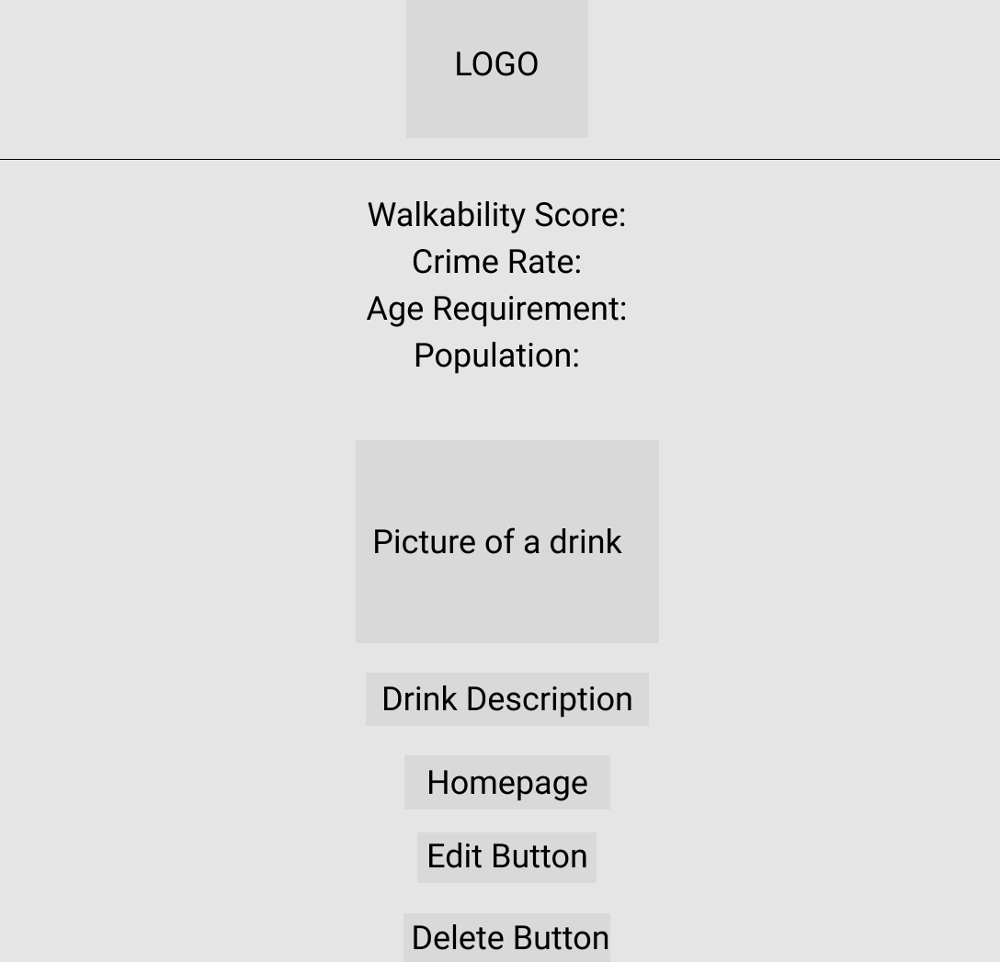
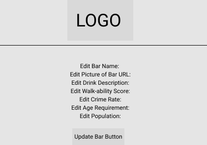
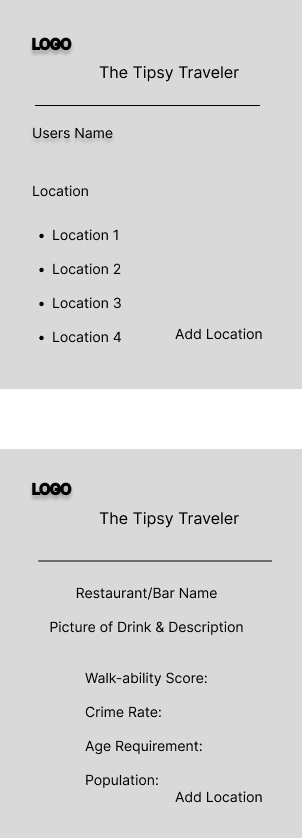
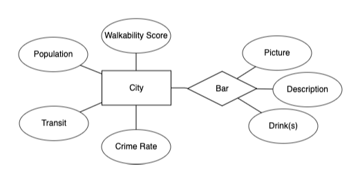

# PROJECT 2

- **Project Name:** TipsyTraveler
- **Project By:** Harpreet Singh
- [**LINK TO GITHUB**](https://github.com/Harp27/TipsyTraveler.git)
- [**LINK TO DEPLOYED WEBSITE**](https://tipsytraveler.onrender.com/)
- **List of Technologies used:** HTML, JS, CSS, Node, Express, EJS, Mongo
- [**LINK TO TRELLO**](https://trello.com/b/dV1f3Px3/tipsytraveler)

## Description

The Tipsy Traveler is an app that allows users to explore various locations and discover the best bars and drinks in each area. It provides essential information such as city/town walkability, crime rate, population, and age requirements for drinking. Users can actively contribute by editing, adding, or deleting locations to ensure up-to-date and accurate information. With The Tipsy Traveler, users can make informed decisions and enhance their nightlife experiences in new cities or their own hometown.

## Mock UP of UI

- 
- 
- 
- 

## List of Backend Endpoints

| ENDPOINT | METHOD | PURPOSE |
|----------|--------|---------|
| /bar | GET | list all locations |
| /bar/new | GET | render page to create new plant |
| /bar/:id | DELETE | delete specified location |
| /bar | POST | recieve new info and create location in database |
| /bar/:id/edit | PUT | edit a location |
| /bar/:id | GET | show page with specified location |

## ERD (ENTITY RELATIONSHIP DIAGRAM)

